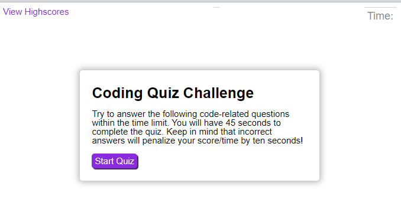
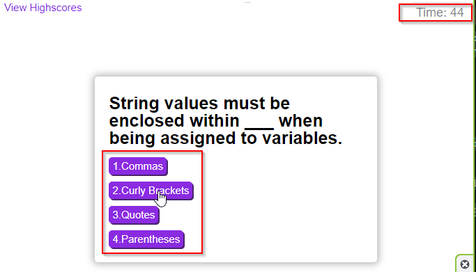
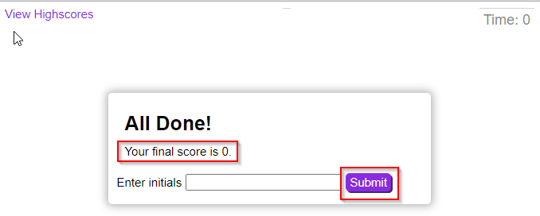
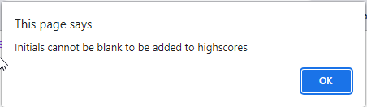
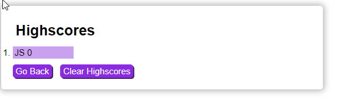
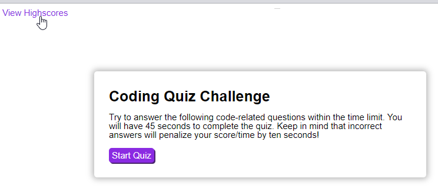

# Coding Quiz | 04 Weekly Challenge

## Description

This application is used to test coding knowledge of users. When the user firsts visits the page they are shown a screen which explains how the quiz functions, and informs the user that wrong answers will penalize the user.

Once the user clicks the start button the timer begins to count down. If the user selects the correct answer then "Correct" reflects below the choices, and then the next question appears. If they select the incorrect answer then "Incorrect!" appears below the choices and 10 seconds is deducted from the remaining time.

The faster the quiz is completed the higher the score. Once all questions have been answered, or the timer hits zero, the user is directed to a page which allows them to enter their intials. Upon submission of this page, the user is then directed to the Highscores, where they can view their previous attempts.

This webpage has been deployed at: https://shockeyj9.github.io/Coding-Quiz/

## Installation

N/A

## Usage

This application uses a purple "Start Quiz" button to start the process. There is also a "View Highscores" link in the top left corner that users can select to be directed to the Highscores display page.

After the quiz is started, the users are presented with a question and a list of potential answers.

Once the timer hits zero or all the questions have been answered, the user is directed to a screen where they are prompted to enter their initials. On this page, user's are given their score.

If the user does not enter their intials and hits the Submit button the following alert is provided:

Once the user has entered their intials and clicked Submit they are directed to the Highscores page. This is where the user can see previous attempts in order from highest to lowest scores

If user's select the "View Highscores" link in the top left corner while within the quiz, they are directed to the Highscores page as well.

## Credits

N/A

## License

Please refer to the LICENSE in the repo.

